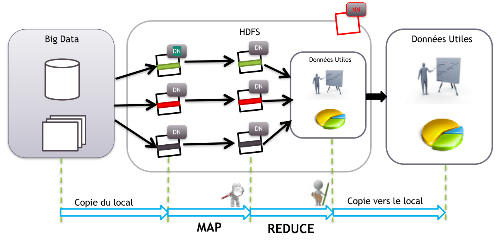

# Big data

## introduction & 5vs

Big data is based on 5 characteristics what we call 5 Vs :

- Volume :

  - Data comes in huge volumes
  - no information is worthless
  - how should it be saved ? Backup strategy ? fault tolerance ?
  - how to access it rapidly and efficiently ?

- Variety:

  - Data comes with no predefined schema, unstructured
  - Multiple data types and formats

- Velocity

  - Data comes in real time and must be stored fast

- Veracity

  - Some data quality may be questionable at best
  - data must be verified and cleaned
  - data my differ in origin
  - some origins can't be trusted

- Value
  - Data can have a lot of value ranging from statistics, analysis, predictions

## Hadoop & Map Reduce

### Hadoop

Hadoop is not a single piece software, it's a set of tools for managing :

- Data storage ( HDFS )
- Data processing ( Map reduce, spark, Yarn ...)

It based on some points :

- Distributed data patterns ( File is divided across multiple machines in chunks )
- Distributed processing patterns what we call clusters
- Prioritize in place data processing ( Data is processed where its stored trying to heavily avoid remote operations)
- Clusters are horizontally scalable alongside data growth

Hadoop can also be used for :

- Data extraction
- Data simplification
- Coordination between tools
- Cluster monitoring

Some good to know tools ( Related and under Yarn / Map-reduce ) :

- Pig: Scripting language
- Hive: Hive Query language
- R connectors ( To query data from hdfs, Use map reduce from R)
- Mahout : Machine learning library
- Oozie: Order map reduce jobs

Some storage tools ( Related and under Yarn / Map-reduce ) :

- Hbase: NoSQL data base
- Impala: get data directly from HDFS or Hbase with hive QL

Data connectors:

- Sqoop : read and write data to and from external sources
- Flume: Collect HDFS logs

Administration:

- Ambari : Administer clusters
- Zookeeper: Centralized configuration service

## HDFS
